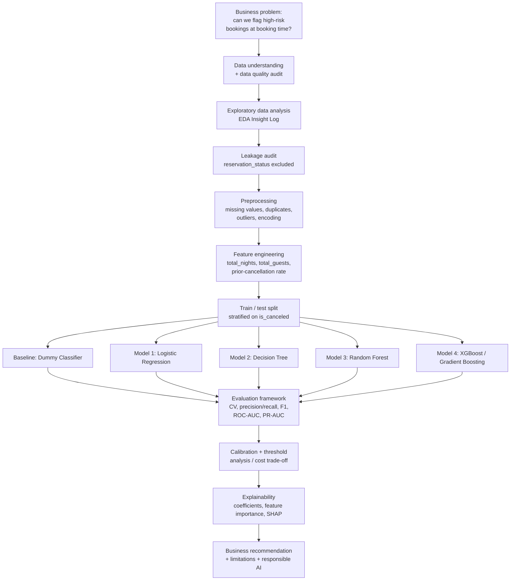
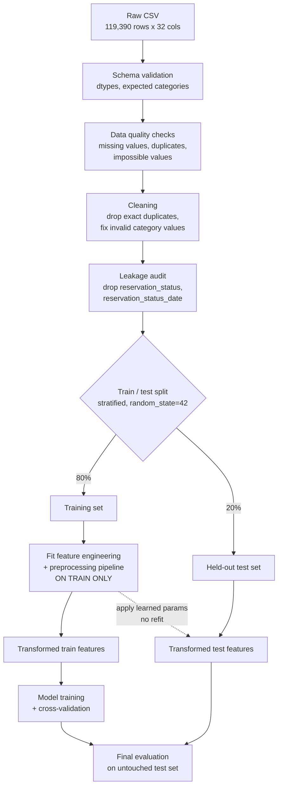
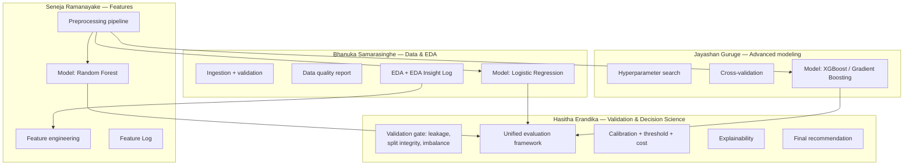

# 2. Workflow Diagram and Architecture

*Rubric: 10 marks — Integration; Learning How to Learn | Reasoning; communication*

This file is the single source of truth for how the project is structured end to
end. The **decision log with options/reasons/evidence lives in
[`../DECISIONS.md`](../DECISIONS.md)** — this file shows the *shape* of the
workflow; `DECISIONS.md` shows *why* each stage was built the way it was.

## 2.1 End-to-end workflow: business problem → recommendation



## 2.2 Data pipeline architecture (leakage-safe)



The critical rule enforced by this diagram: **the preprocessing pipeline (imputers,
encoders, scalers) is fit on the training split only**, then applied unchanged to
the test split. This is implemented as a single `sklearn.pipeline.Pipeline` +
`ColumnTransformer` object shared by every model, so no team member can
accidentally fit their own preprocessing on the full dataset.

## 2.3 Team / module ownership architecture



Everyone consumes the **same** cleaned dataset (from M1) and the **same**
feature/preprocessing pipeline (from M2) — this prevents the classic group-project
failure mode where each member trains on a slightly different version of the data
and results become incomparable. See
[`team/roles-and-raci.md`](team/roles-and-raci.md) for the full RACI matrix and
per-member deliverables/definition-of-done.

## 2.4 Repository structure

```text
hotel-booking-cancellation-ml/
├── data/
│   └── hotel_bookings.csv                  # raw, untouched — never edited in place
├── docs/                                   # this documentation
│   └── team/
├── ai-usage-disclosure/                    # per-member AI-use logs
├── notebooks/                              # one notebook per pipeline stage/model
├── src/                                    # reusable pipeline code imported by notebooks
├── reports/
│   └── figures/                            # exported charts used in the final report
├── PROGRESS.md                             # live status tracker
└── DECISIONS.md                            # decision log: options, choice, reason, evidence
```

## 2.5 How to use the decision log

Every non-trivial choice referenced in this workflow (how missing values are
treated, which variables are dropped for leakage, which models are compared, which
metric decides the "winner") must have a row in `../DECISIONS.md` with: the
alternatives considered, the choice made, the reason, and the evidence that
supports it. This file is graded directly against rubric criterion 2, so it is not
optional bookkeeping — it is the primary evidence of reasoning.
